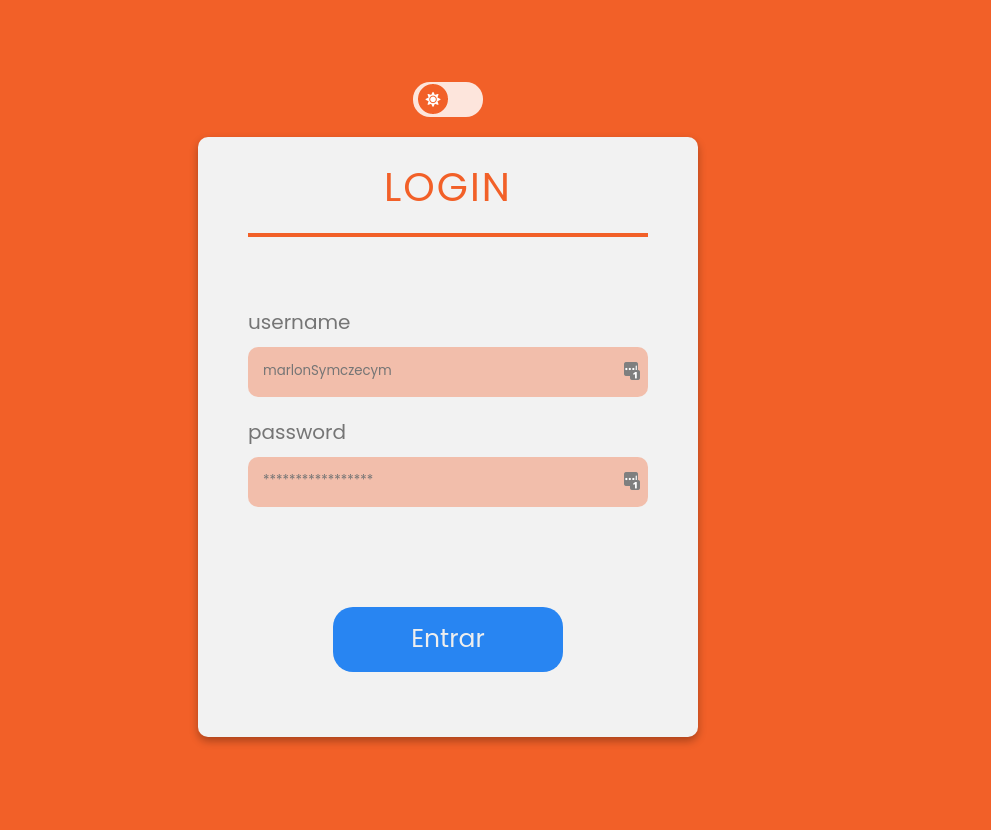
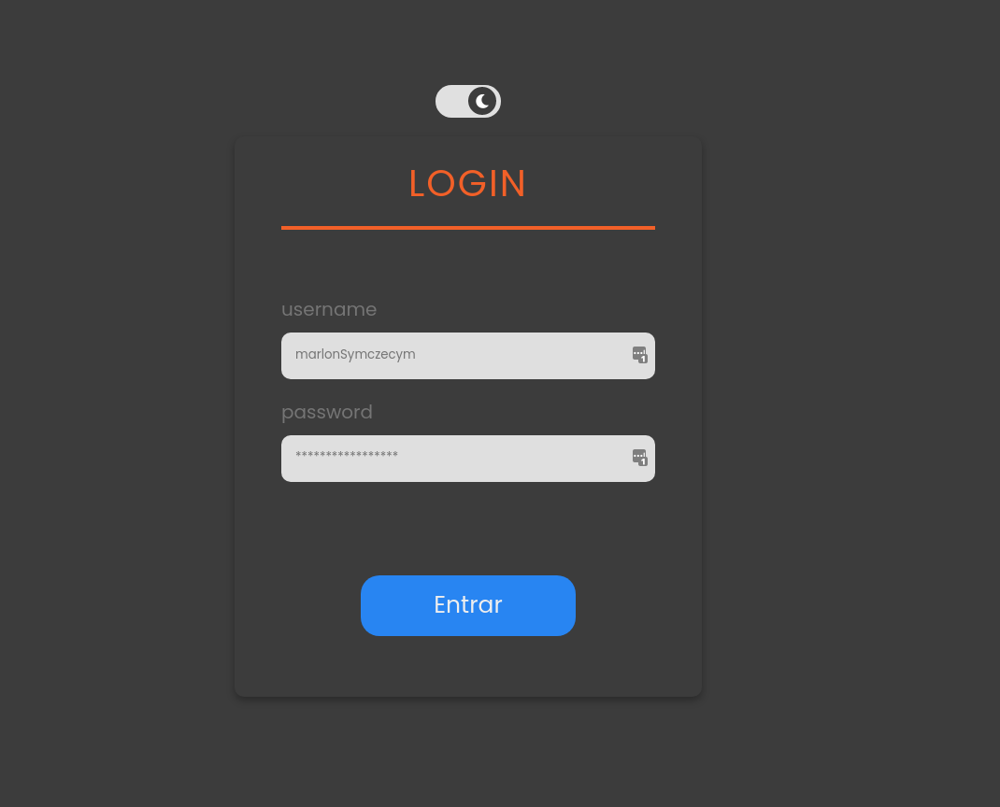
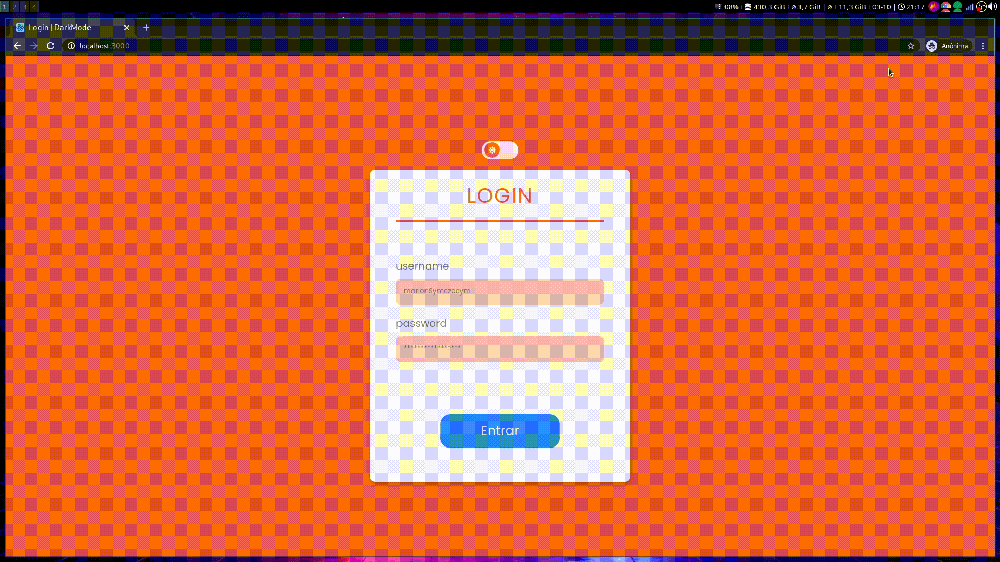

# Login DarkMode

  
  

O layout produzido foi feito por mim mesmo Marlon Symczecym, e a parte da programação também.

O projeto foi feito para treinar conceitos que foram apresentados por mim via o curso de ReactJs da empresa Origamid.
O intuito foi conhecer bem o framework/biblioteca, para estar a par de ferramentas mais modernas se eu precisar um dia.
E vi que o ReactJs é fantástico para desenvolvimento reativo, rápido e de alta performance

## Ferramentas

No projeto foi utilizado:

- CSS3
- HTML5
- ReactJs
- JSX

# RESULTADO

## AUTOR

Marlon Symczecym

**Linkedin:** [Marlon Symczecym](https://www.linkedin.com/in/marlonsymczecym/)
